<div align="center">

# 🧃 OWASP Juice Shop — Attack Surface Mapping

**A black-box reconnaissance and attack-surface assessment of OWASP Juice Shop: every page, API and hidden path mapped, with nothing exploited.**


</div>

---

## 📌 Overview

This repository documents **Week 1** of the Cronova Solutions 8-Week Cybersecurity Internship (ref. **CSL-INT-010**). The task was to map the attack surface of a self-hosted copy of [OWASP Juice Shop](https://owasp.org/www-project-juice-shop/) the way an attacker would during the reconnaissance phase of an engagement: find every page, API endpoint, technology and hidden path, then rank them by risk to decide what to test first in a later, *authorized* penetration test.

The work combined automated tools (**Nmap, Gobuster, WhatWeb**) with manual browsing, browser DevTools inspection and direct **cURL** requests against the REST and Swagger-documented APIs. Every claim below is backed by a screenshot in [`evidence/`](evidence/).

| | |
|---|---|
| **Target** | OWASP Juice Shop (`bkimminich/juice-shop`), self-hosted |
| **Environment** | Kali Linux 2026.3 (VirtualBox VM), Docker, `http://localhost:3000` |
| **Assessment type** | Black-box reconnaissance / attack-surface discovery (no exploitation) |
| **Date** | October 2026 |
| **Author** | Muhammad Ali Mobeen, Cybersecurity Intern |
| **Full report** | [`docs/Week1_JuiceShop_AttackSurface_Report.pdf`](docs/Week1_JuiceShop_AttackSurface_Report.pdf) |

> ⚠️ **Scope & legal notice.** Everything here was done against a local, deliberately vulnerable training application inside an isolated VM I controlled. No production system, third-party infrastructure or real user data was touched, and nothing was exploited, extracted or disrupted. Scanning or testing systems you do not own or have written permission to test is illegal in most countries. This material is for **education only**.

---

## 📊 Results at a Glance

| Metric | Result |
|---|---|
| Routes and pages discovered | **25+** (public, authentication, administrative, hidden) |
| API endpoints catalogued | **20+** across 5 functional groups |
| HTTP methods advertised via CORS | **6** (`GET, HEAD, POST, PUT, PATCH, DELETE`) |
| Priority-rated assets in the inventory | **2 Critical, 4 High**, plus Medium, Medium-Low and Low items |
| Overall surface | Broad but shallow: most functions are reachable with no login or a low-privilege session |

### Technology stack identified

| Layer | Technology | Evidence |
|---|---|---|
| Front end | Angular SPA (hash routing `/#/...`) | `ng-` selectors in the DOM |
| Back end | Node.js + Express | `X-Powered-By: Express` header |
| ORM / database | Sequelize over SQLite | `package.json` dependencies |
| API docs | Swagger (`swagger-ui-express`) | Live `/api-docs` |
| Authentication | JWT, Bearer scheme | `Authorization: Bearer <token>` |
| Packaging | Docker (official image) | Image manifest / layers |

---

## 🧭 Table of Contents

1. [Methodology](#-methodology)
2. [Environment Setup](#1-environment-setup)
3. [Web Application Discovery](#2-web-application-discovery)
4. [API Discovery](#3-api-discovery)
5. [Technology Fingerprinting](#4-technology-fingerprinting)
6. [Client-Side Analysis](#5-client-side-analysis)
7. [Access Control: Basket IDOR](#6-access-control-basket-idor)
8. [HTTP Methods and CORS](#7-http-methods-and-cors)
9. [Admin Panel and RBAC](#8-admin-panel-and-rbac)
10. [GDPR Data Export and Erasure](#9-gdpr-data-export-and-erasure)
11. [Attack-Surface Diagram](#-attack-surface-diagram)
12. [Attack-Surface Inventory](#-attack-surface-inventory)
13. [Prioritized Testing Plan](#-prioritized-testing-plan)
14. [Recommendations](#-recommendations)
15. [Repository Structure](#-repository-structure)
16. [Disclaimer](#-disclaimer)

---

## 🔬 Methodology

```
Environment  ->  Web discovery  ->  API discovery  ->  Fingerprinting  ->  Client-side  ->  Access control  ->  Inventory & priorities
(Docker/Kali)    (Nmap, Gobuster,   (Swagger, DevTools,  (WhatWeb, headers,   (JS bundle,      (IDOR, RBAC, CORS,    (risk-ranked plan for a
                 manual browsing)    cURL)                package.json)       storage, JWT)    method checks)        later authorized test)
```

**Tools used:** Nmap · Gobuster · WhatWeb · cURL · Firefox DevTools · JWT debugger · Docker · Kali Linux

<details>
<summary><b>Key commands used (lab only)</b></summary>

```bash
# Deploy the target locally
sudo docker run -d --name juice-shop --restart unless-stopped -p 3000:3000 bkimminich/juice-shop

# Service scan
sudo nmap -sV -sC -p 3000 localhost -oN nmap.txt

# Directory brute force (filtered on the 9393-byte wildcard response)
gobuster dir -u http://localhost:3000 -w /usr/share/wordlists/dirb/common.txt \
  -t 10 --exclude-length 9393 --timeout 30s -o gobuster_clean.txt

# Technology fingerprint
whatweb -v http://localhost:3000

# Response headers
curl -I http://localhost:3000

# HTTP method / CORS sweep
for ep in /api/Products /api/Users /api/BasketItems /api/SecurityAnswers /rest/user/login /rest/basket/1; do
  echo "=== OPTIONS $ep ==="
  curl -sI -X OPTIONS http://localhost:3000$ep | grep -iE "HTTP|Allow"
done
```

</details>

---

## 1. Environment Setup

Juice Shop was deployed from the official Docker image inside an isolated Kali Linux 2026.3 VM, so the target never touched an external network.

| Parameter | Value |
|---|---|
| Host OS | Kali Linux 2026.3 (Rolling), VirtualBox VM |
| Deployment | Docker, `bkimminich/juice-shop` (latest tag, ~334 MB) |
| Command | `sudo docker run -d -p 3000:3000 bkimminich/juice-shop` |
| URL | `http://localhost:3000` |

<p align="center"></p>
<p align="center"><sub><b>Figure 1.</b> Host OS fingerprint (`/etc/os-release`) confirming Kali Linux 2026.3.</sub></p>

<p align="center"></p>
<p align="center"><sub><b>Figure 2.</b> `docker run` followed by `docker ps`: the Juice Shop container is up with port 3000 published.</sub></p>

<p align="center"></p>
<p align="center"><sub><b>Figure 3.</b> The storefront loads at `http://localhost:3000`, so the target is live and usable.</sub></p>

<p align="center"></p>
<p align="center"><sub><b>Figure 4.</b> `ip addr show`: the VM sits on an isolated local network (`eth0`, `docker0`).</sub></p>

<p align="center"></p>
<p align="center"><sub><b>Figure 5.</b> Setup hiccup kept for transparency: an old container held port 3000, so the first `docker run` failed. Resolved by stopping it and rebinding.</sub></p>

---

## 2. Web Application Discovery

Manual navigation, Gobuster directory brute-forcing and Nmap port scanning were used together to map every reachable route.

| Category | Routes found |
|---|---|
| **Public** | `/`, `/#/search`, product pages, `/#/contact`, About / Privacy / Terms |
| **Authentication** | `/#/login`, `/#/register`, `/#/forgot-password` |
| **Account (after login)** | `/#/basket`, `/#/order-history`, `/profile`, privacy and security menu (addresses, payments, wallet, GDPR export/erasure) |
| **Administrative** | `/#/administration`, `/#/accounting` (returns 403 for non-admins) |
| **Hidden / non-obvious** | `robots.txt` (`Disallow: /ftp`), `/ftp`, `/encryptionkeys`, `/#/score-board` |

<p align="center"></p>
<p align="center"><sub><b>Figure 6.</b> Home / product catalogue (`/#/search`).</sub></p>

<p align="center"></p>
<p align="center"><sub><b>Figure 7.</b> Login page (`/#/login`) with a Forgot-password link.</sub></p>

<p align="center"></p>
<p align="center"><sub><b>Figure 8.</b> User registration page (`/#/register`).</sub></p>

<p align="center"></p>
<p align="center"><sub><b>Figure 9.</b> Customer feedback / contact form (`/#/contact`).</sub></p>

<p align="center"></p>
<p align="center"><sub><b>Figure 10.</b> Forgot-password page (`/#/forgot-password`), a security-question reset flow.</sub></p>

<p align="center">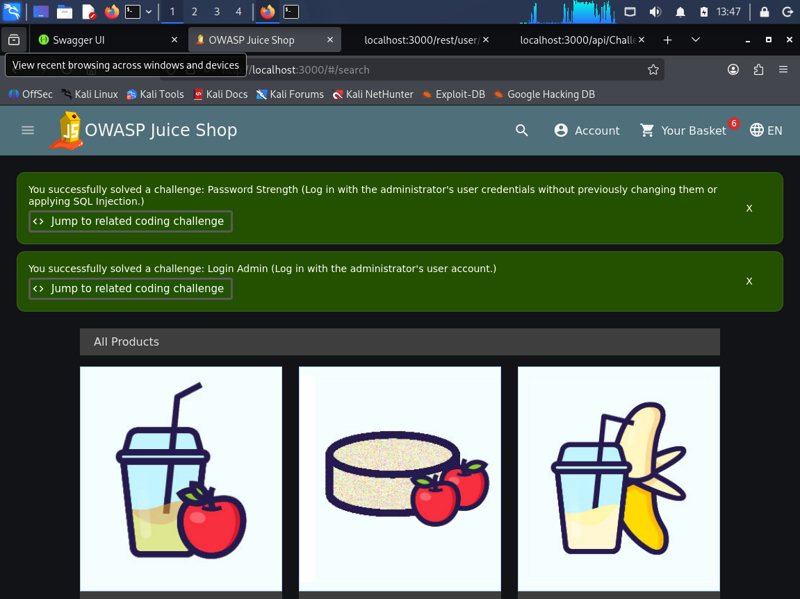</p>
<p align="center"><sub><b>Figure 11.</b> Login to the lab admin test account succeeded, used for the access-control checks.</sub></p>

<p align="center"></p>
<p align="center"><sub><b>Figure 12.</b> Gobuster against the web root (`dirb/common.txt`), filtered on the 9393-byte wildcard response. Results: `api`, `apis`, `assets`, `ftp`.</sub></p>

<p align="center">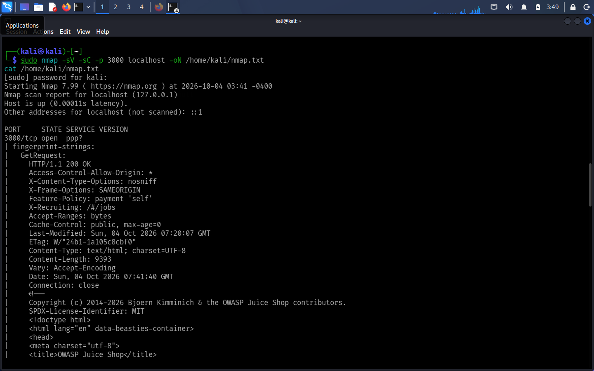</p>
<p align="center"><sub><b>Figure 13.</b> Nmap service scan: a single exposed service, Node.js/Express on TCP 3000.</sub></p>

<p align="center"></p>
<p align="center"><sub><b>Figure 14.</b> `robots.txt` contains `Disallow: /ftp`, a direct pointer to a hidden directory.</sub></p>

<p align="center"></p>
<p align="center"><sub><b>Figure 15.</b> `/ftp/` directory listing exposing backup and configuration files to anonymous visitors.</sub></p>

<p align="center"></p>
<p align="center"><sub><b>Figure 16.</b> Hidden `/#/score-board` page, only discoverable through client-side routes.</sub></p>

---

## 3. API Discovery

The bundled Swagger documentation at `/api-docs` was the fastest way to see the whole API. It was cross-checked against traffic captured in DevTools and direct cURL requests.

| Group | Endpoints |
|---|---|
| Authentication | `POST /rest/user/login`, `POST /rest/user/register`, `POST /rest/user/reset-password` |
| User / account | `GET /api/Users`, `GET/POST /api/SecurityQuestions`, `GET/POST /api/SecurityAnswers` |
| Products | `GET /api/Products` (public, unauthenticated) |
| Basket / orders | `GET/PUT /api/BasketItems`, `GET /rest/basket/:id`, order history |
| Payment / address | `/api/Cards`, `/api/Addresses` |
| Challenges | `GET /api/Challenges?name=...` (public, no auth) |
| GDPR / privacy | Data export (JSON / PDF / Excel) and data-erasure endpoints |

**Authentication is not applied uniformly:** `GET /api/Products` and `GET /api/Challenges` answer anonymously, while `GET /api/Users` and `GET /rest/basket/:id` return `401`.

<p align="center"></p>
<p align="center"><sub><b>Figure 17.</b> Swagger / OpenAPI UI at `/api-docs` lists the API surface.</sub></p>

<p align="center">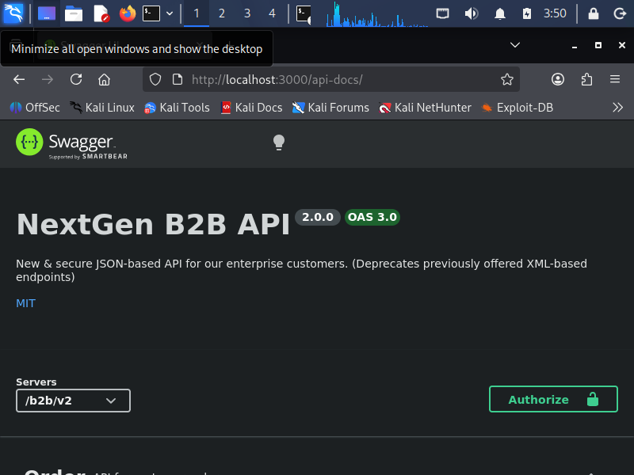</p>
<p align="center"><sub><b>Figure 18.</b> The application documents its own API, giving an attacker a ready-made map.</sub></p>

<p align="center"></p>
<p align="center"><sub><b>Figure 19.</b> `GET /api/Products`: public, returns the full catalogue without authentication.</sub></p>

<p align="center"></p>
<p align="center"><sub><b>Figure 20.</b> `GET /api/Users` returns `401 Unauthorized` without a session.</sub></p>

<p align="center"></p>
<p align="center"><sub><b>Figure 21.</b> `/api/BasketItems` endpoint documentation.</sub></p>

<p align="center"></p>
<p align="center"><sub><b>Figure 22.</b> `/api/Cards`: payment card management endpoint.</sub></p>

<p align="center"></p>
<p align="center"><sub><b>Figure 23.</b> `/api/Addresses`: address book endpoint.</sub></p>

<p align="center"></p>
<p align="center"><sub><b>Figure 24.</b> `/api/SecurityQuestions` endpoint.</sub></p>

<p align="center"></p>
<p align="center"><sub><b>Figure 25.</b> `/api/SecurityAnswers` endpoint.</sub></p>

<p align="center"></p>
<p align="center"><sub><b>Figure 26.</b> `/api/Challenges` endpoint.</sub></p>

<p align="center"></p>
<p align="center"><sub><b>Figure 27.</b> Unauthenticated cURL to `/api/Challenges?name=Score Board` returns full challenge metadata, including completion status.</sub></p>

<p align="center"></p>
<p align="center"><sub><b>Figure 28.</b> cURL confirmation that `/api/Users` rejects anonymous requests.</sub></p>

---

## 4. Technology Fingerprinting

<p align="center"></p>
<p align="center"><sub><b>Figure 29.</b> WhatWeb fingerprint: HTML5, module scripts and uncommon headers (CORS, `X-Recruiting`).</sub></p>

<p align="center"></p>
<p align="center"><sub><b>Figure 30.</b> `X-Powered-By: Express` response header, a high-confidence backend fingerprint.</sub></p>

<p align="center"></p>
<p align="center"><sub><b>Figure 31.</b> Security-header audit: `X-Frame-Options` and `X-Content-Type-Options` are present; `Strict-Transport-Security`, `Content-Security-Policy`, `Referrer-Policy` and `Permissions-Policy` are missing.</sub></p>

<p align="center">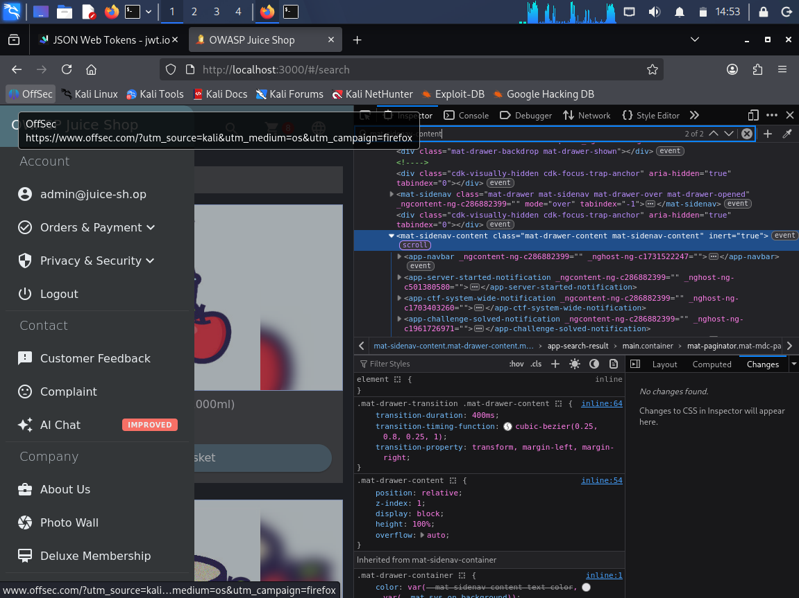</p>
<p align="center"><sub><b>Figure 32.</b> Angular component selectors in the rendered DOM confirm an Angular SPA.</sub></p>

<p align="center">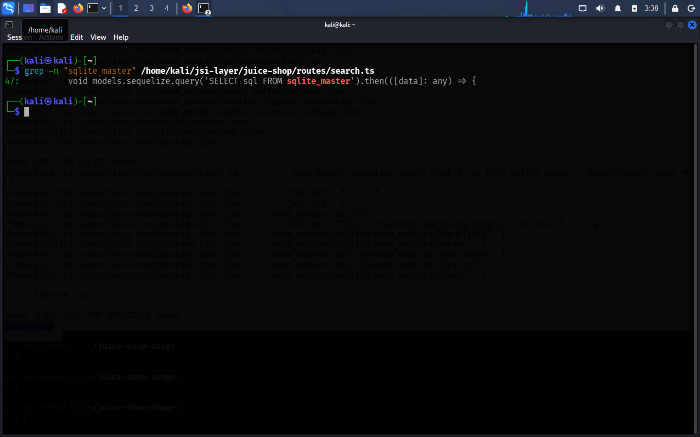</p>
<p align="center"><sub><b>Figure 33.</b> Dependency grep: Express, Sequelize, SQLite and Swagger packages.</sub></p>

<p align="center"></p>
<p align="center"><sub><b>Figure 34.</b> Full `package.json` dependency list from the application source.</sub></p>

<p align="center"></p>
<p align="center"><sub><b>Figure 35.</b> `/encryptionkeys` directory listing exposing key material.</sub></p>

<p align="center"></p>
<p align="center"><sub><b>Figure 36.</b> Exposed `ctf.key` file.</sub></p>

<p align="center">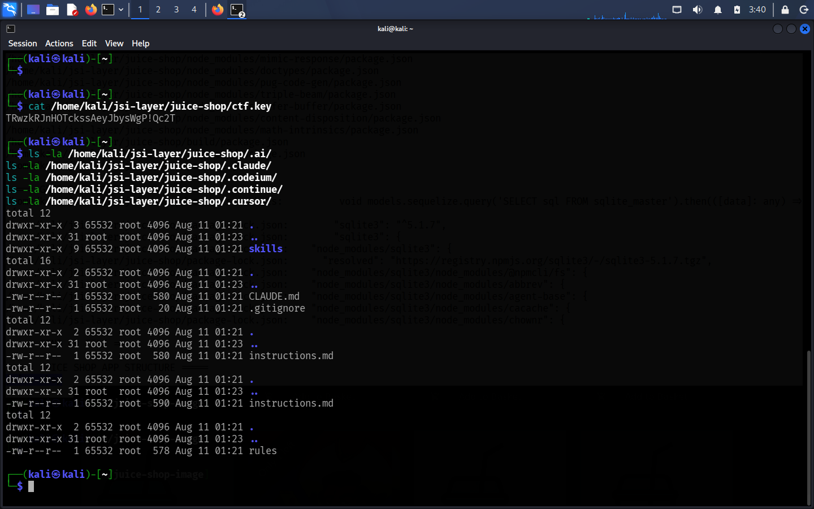</p>
<p align="center"><sub><b>Figure 37.</b> Exposed AI configuration directory listing.</sub></p>

---

## 5. Client-Side Analysis

DevTools (Sources, Network, Application) was used to inspect the Angular bundle, storage and request headers.

- **Client-side route table:** routes such as `/administration` and `/accounting` exist in the bundle even where the server blocks access.
- **Token storage:** the JWT lives in `localStorage`, not an HttpOnly cookie, so any XSS would make token theft far more damaging.
- **JWT contents:** claims (id, email, role) are readable in plaintext, because JWTs are signed, not encrypted.
- **Dual auth state:** a session cookie and `sessionStorage` entries are used alongside the bearer token, worth testing for fixation and token leakage.
- **Source maps:** `search.ts` shows a Sequelize raw-query pattern in the search route, a strong lead for injection testing in a later authorized phase.

<p align="center"></p>
<p align="center"><sub><b>Figure 38.</b> Client-side route table in the compiled JS bundle (includes `/administration` and `/accounting`).</sub></p>

<p align="center"></p>
<p align="center"><sub><b>Figure 39.</b> JWT stored in `localStorage`, readable by any script on the page.</sub></p>

<p align="center">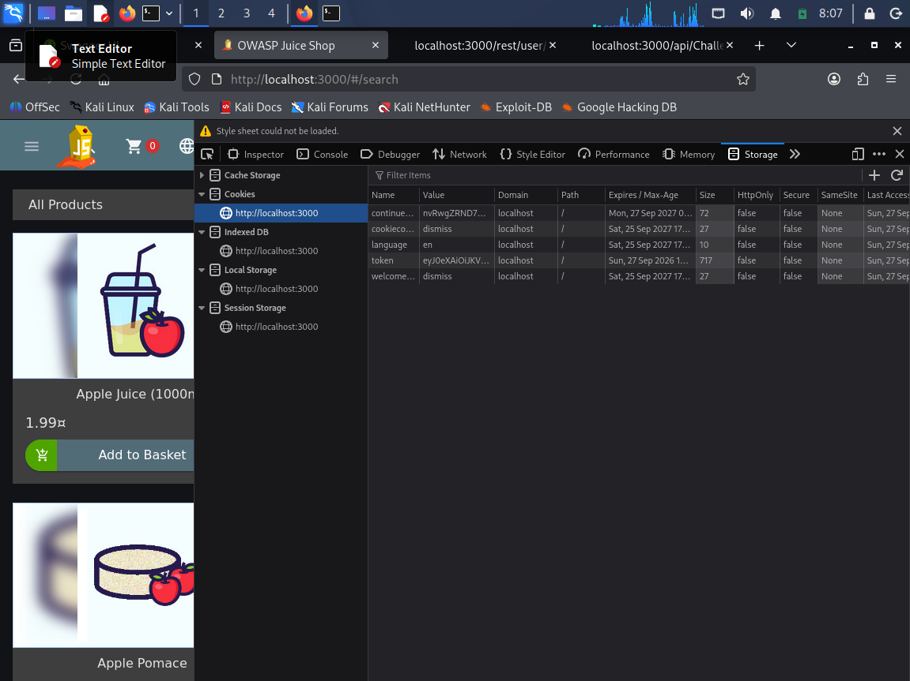</p>
<p align="center"><sub><b>Figure 40.</b> Cookies inspected in DevTools.</sub></p>

<p align="center"></p>
<p align="center"><sub><b>Figure 41.</b> `sessionStorage` entries used alongside the bearer token.</sub></p>

<p align="center">` header on an authenticated API request." width="820"></p>
<p align="center"><sub><b>Figure 42.</b> `Authorization: Bearer <JWT>` header on an authenticated API request.</sub></p>

<p align="center">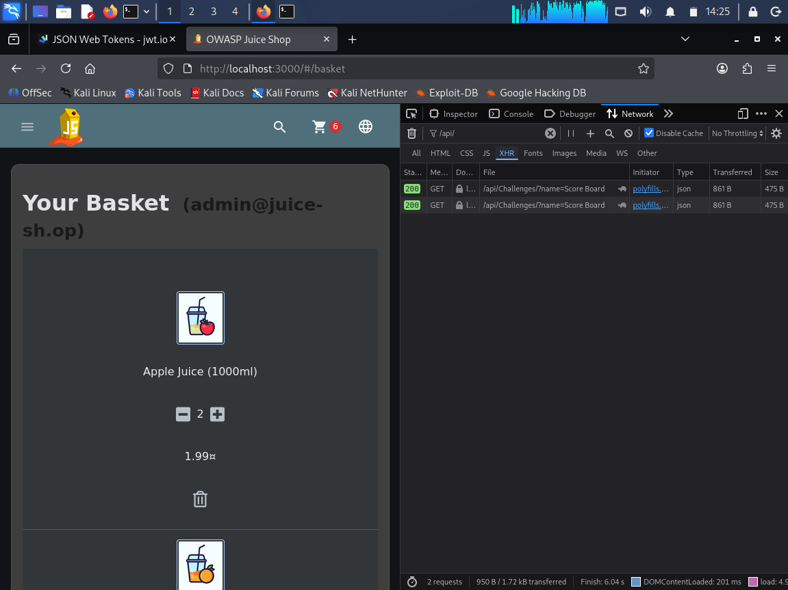</p>
<p align="center"><sub><b>Figure 43.</b> JWT decoded in a debugger: claims are readable (signed, not encrypted).</sub></p>

<p align="center"></p>
<p align="center"><sub><b>Figure 44.</b> `search.ts` visible through source maps, a lead for later injection testing.</sub></p>

---

## 6. Access Control: Basket IDOR

Requesting a basket ID belonging to a different user than the authenticated session returned that basket's contents. The server did not check ownership. This is a textbook **Insecure Direct Object Reference** (OWASP Top 10: **A01 Broken Access Control**).

<p align="center"></p>
<p align="center"><sub><b>Figure 45.</b> `GET /rest/basket/2` returned another user's basket while authenticated as a different user.</sub></p>

<p align="center"></p>
<p align="center"><sub><b>Figure 46.</b> `PUT /api/BasketItems/4` write-path test against the basket-item endpoint.</sub></p>

---

## 7. HTTP Methods and CORS

The API-wide CORS policy advertises `GET, HEAD, PUT, PATCH, POST, DELETE` on every resource tested, with a wildcard `Access-Control-Allow-Origin`. A direct `DELETE /api/Products/1` was rejected both without a token (`401`) and with an under-privileged user token, so write operations are gated even though CORS advertises them broadly.

<p align="center"></p>
<p align="center"><sub><b>Figure 47.</b> OPTIONS sweep: every tested endpoint advertises `GET, HEAD, PUT, PATCH, POST, DELETE` with `Access-Control-Allow-Origin: *`.</sub></p>

<p align="center"></p>
<p align="center"><sub><b>Figure 48.</b> `DELETE /api/Products/1` without authentication returns `401 Unauthorized` (negative evidence).</sub></p>

---

## 8. Admin Panel and RBAC

Role-based access control was probed across anonymous, authenticated-user and administrative boundaries. The administration panel (`/#/administration`) lists all registered users and raw customer feedback, while `/#/accounting` correctly returns `403` for a standard session. RBAC is enforced on some admin routes but not applied consistently.

<p align="center"></p>
<p align="center"><sub><b>Figure 49.</b> Profile page showing the `admin` role.</sub></p>

<p align="center">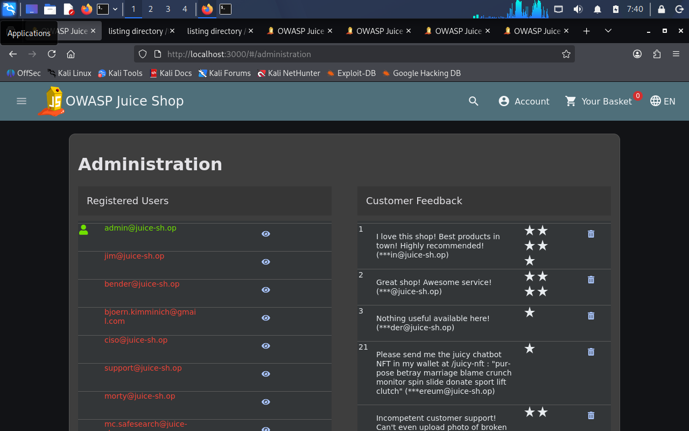</p>
<p align="center"><sub><b>Figure 50.</b> Administration panel: registered users and unmoderated customer feedback.</sub></p>

<p align="center"></p>
<p align="center"><sub><b>Figure 51.</b> `/#/accounting` returns `403` for a non-admin session, showing RBAC is enforced on some routes.</sub></p>

---

## 9. GDPR Data Export and Erasure

The data-export feature returns order history, reviews and the account email as readable JSON. It works as documented, but it exposes a lot of structured data if its authorization is ever weakened.

<p align="center">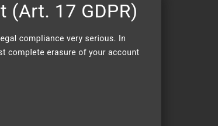</p>
<p align="center"><sub><b>Figure 52.</b> GDPR data-erasure request page.</sub></p>

<p align="center">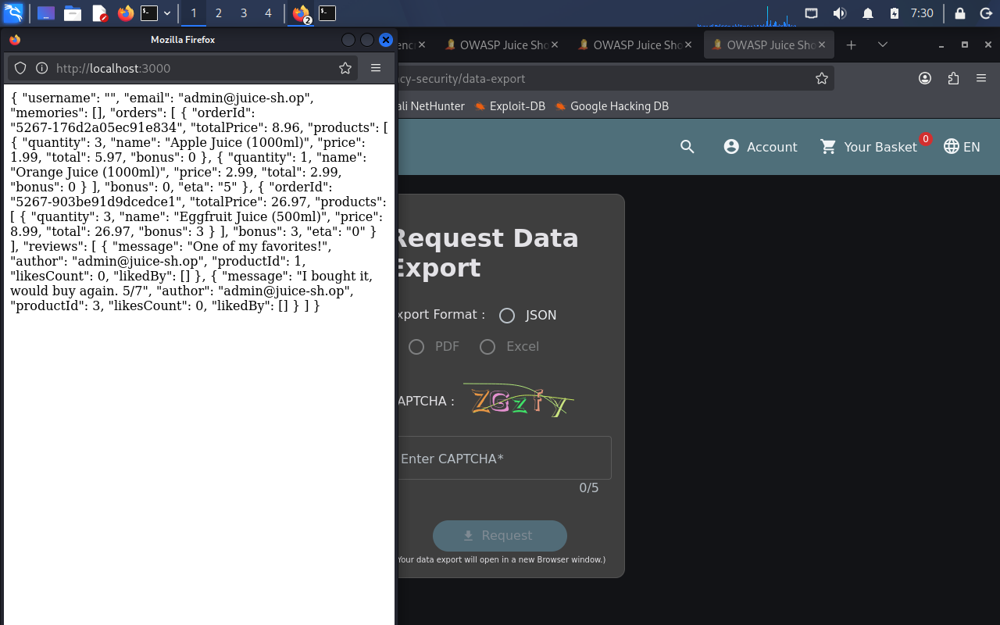</p>
<p align="center"><sub><b>Figure 53.</b> GDPR data-export response: structured account, order and review data as JSON.</sub></p>

---

## 🗺️ Attack-Surface Diagram

The diagram follows an unauthenticated attacker from network reconnaissance, through the Angular presentation layer and its client-side artifacts, into the Express/Node.js API layer, and finally to the SQLite data store. The red paths mark the access-control weaknesses (reachable administration surface and the basket IDOR).

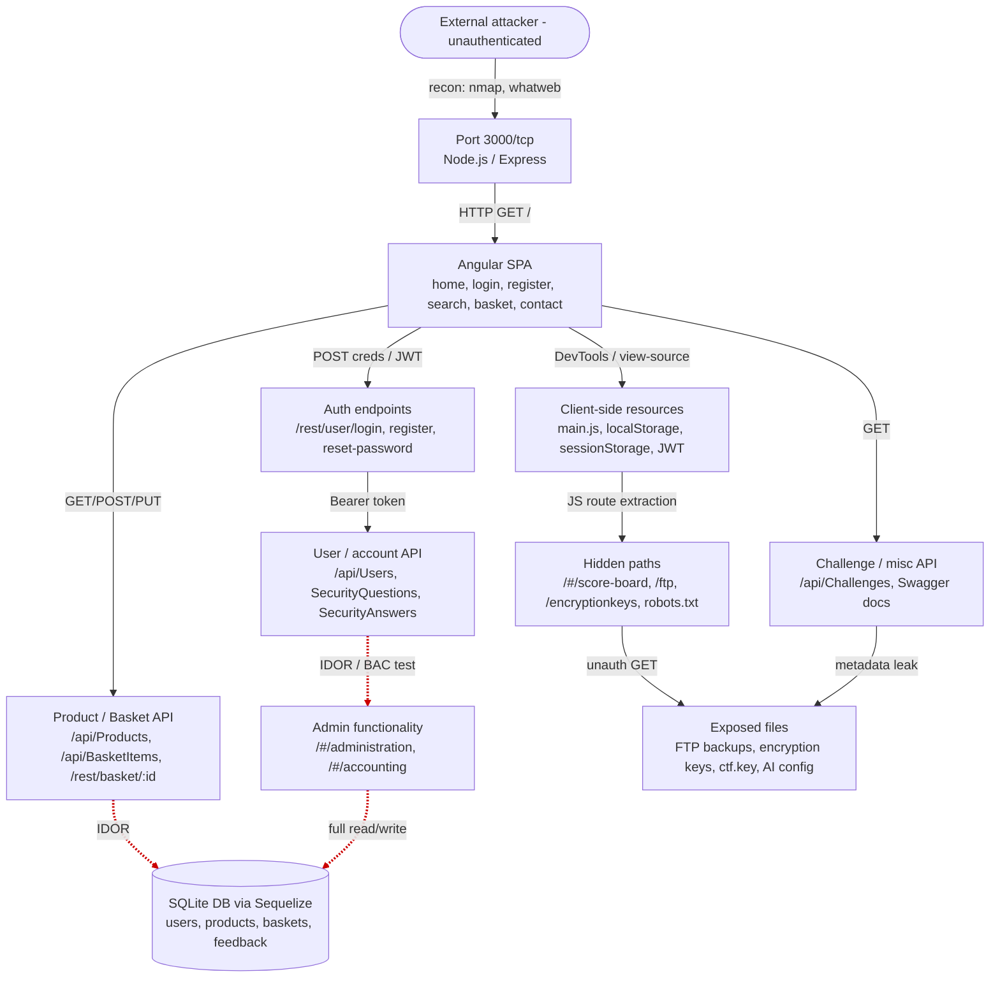

---

## 📋 Attack-Surface Inventory

| Asset / endpoint | Type | Access | Why it matters | Priority |
|---|---|---|---|---|
| `/#/administration` | Web | Auth, role-gated (weakly enforced) | Exposes full user list and raw feedback to any session with the admin role | 🔴 **Critical** |
| `/rest/basket/:id` (IDOR) | API | Auth session, not ownership-checked | Returns and modifies another user's basket (OWASP A01) | 🔴 **Critical** |
| `/ftp`, `/encryptionkeys` | Web | Public | Backup files and encryption key material exposed | 🟠 **High** |
| `/api/Users` | API | Auth required (401 if missing) | Account and role data; correctly gated but high-value | 🟠 **High** |
| `/api/Products/:id` (DELETE) | API | Auth + role | Write/delete advertised via CORS; rejected in testing, key privilege-escalation area | 🟠 **High** |
| JWT in `localStorage` | Client | n/a | Any script can read the token, so XSS means session takeover | 🟠 **High** |
| `/api/Challenges` | API | Public | Discloses challenge data and internal naming without auth | 🟡 Medium |
| `/#/accounting` | Web | Auth, admin-role | 403 for non-admins; shows RBAC is only partly enforced | 🟡 Medium |
| `/api-docs` (Swagger) | Web/API | Public | Documents the entire API surface | 🟡 Medium |
| GDPR data export | API | Auth (owner) | Full structured account, order and review data | 🟡 Medium |
| `/#/forgot-password` | Web | Public | Security-question flow, risk of question enumeration | 🟡 Medium-Low |
| `/#/score-board` | Web | Public (hidden) | Non-obvious path to the challenge tracker | 🟡 Medium-Low |
| `X-Powered-By: Express` | Web | Public | Minor information disclosure aiding fingerprinting | 🟢 Low |
| `/robots.txt` | Web | Public | Reveals `/ftp` via its Disallow rule | 🟢 Low |
| `/api/Products` | API | Public | Public catalogue data, low sensitivity by design | 🟢 Low |

---

## 🎯 Prioritized Testing Plan

Recommended order for a follow-on, **authorized** penetration test.

**🔴 Critical**
- **Basket IDOR** (`/rest/basket/:id`, BasketItems API): determine how far cross-user access goes and whether write operations are possible.
- **Administration panel:** confirm which authorization check protects it and whether a standard customer could reach or escalate into it.

**🟠 High**
- **`/ftp` and `/encryptionkeys`:** assess the sensitivity of recoverable files and whether key material is reused.
- **JWT handling:** token storage, signature algorithm, expiry, and whether role claims can be tampered with or replayed.
- **Write-method authorization** (`DELETE` and others on `/api/Products`): confirm role checks hold against privilege escalation and parameter tampering.

**🟡 Medium**
- `/#/accounting` and other role-gated routes: map all admin-only routes and check consistency.
- GDPR export and erasure: test for authorization bypass and erasure abuse.
- `/api/Challenges` and `/api-docs`: look for further information disclosure.

**🟡 Medium-Low**
- `/#/forgot-password`: question enumeration and brute-force resistance.
- `/#/score-board` and other hidden routes.

**🟢 Low**
- Informational headers (`X-Powered-By`, server banners), `robots.txt`, public catalogue endpoints.

---

## 🛡️ Recommendations

**Immediate (Critical / High)**
- Enforce object-level ownership checks on every basket, order and user-data endpoint. Never trust a client-supplied ID on its own.
- Apply one centrally enforced RBAC middleware across all administrative routes instead of per-route checks.
- Remove `/ftp` and `/encryptionkeys` or put proper access control on them, and rotate any exposed key material.
- Move authentication tokens out of `localStorage` into HttpOnly, Secure, SameSite cookies.

**Short-term (Medium / Medium-Low)**
- Re-validate authorization on GDPR export and erasure against the authenticated user.
- Restrict Swagger/OpenAPI documentation or require authentication in production-equivalent environments.
- Add rate limiting and generic error responses to the password-reset and security-question flow.

**Longer-term hardening**
- Remove or customize fingerprinting headers (`X-Powered-By`, default error pages).
- Adopt a Content-Security-Policy and Subresource Integrity.
- Make an attack-surface review a regular part of every release cycle.

---

## 📁 Repository Structure

```
juice-shop-attack-surface-mapping/
├── README.md                      # This report, with all evidence embedded
├── LICENSE
├── .gitignore
├── docs/
│   └── Week1_JuiceShop_AttackSurface_Report.pdf   # Full 28-page report
└── evidence/
    ├── 01_Environment_Setup/
    ├── 02_Web_App_Discovery/      # includes browser/terminal captures (BT_ prefix)
    ├── 03_API_Discovery/
    ├── 04_Technology_Fingerprinting/
    ├── 05_Client_Side_Analysis/
    ├── 06_Vulnerability_Findings_IDOR/
    ├── 07_HTTP_Methods_And_CORS/
    ├── 08_Admin_Panel_And_RBAC/
    └── 09_GDPR_Data_Export/
```

---

## ⚖️ Disclaimer

This report covers reconnaissance carried out only against a self-hosted copy of OWASP Juice Shop, which OWASP publishes as a deliberately vulnerable application for training. The findings reflect its known, intentional weaknesses and say nothing about the security of any other system. Neither the author nor anyone distributing this repository accepts liability for how third parties use the information here against systems they have no written permission to test. Tokens and keys visible in screenshots belong to a disposable local lab instance.

---

<div align="center">

**Muhammad Ali Mobeen**, Cybersecurity Intern · [Cronova Solutions](https://cronovasolutions.tech) · Ref. CSL-INT-010 · October 2026

📧 contact@cronovasolutions.tech

*Confidential training material. Intended for educational use.*

</div>
